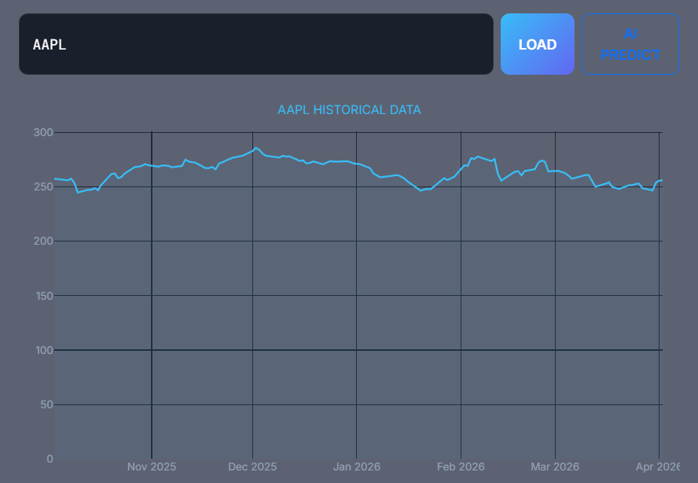
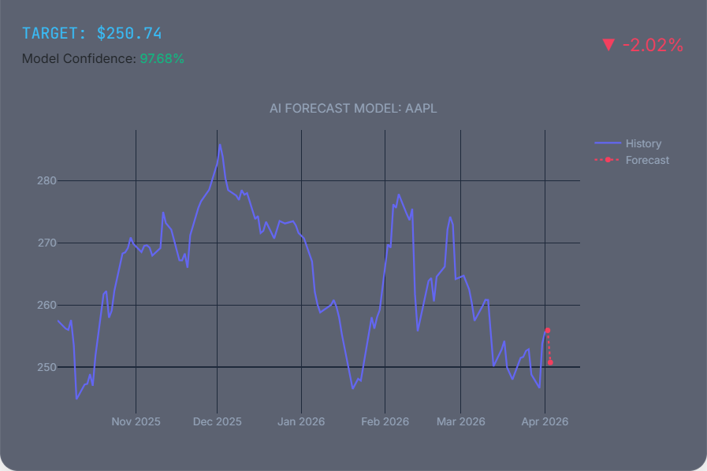
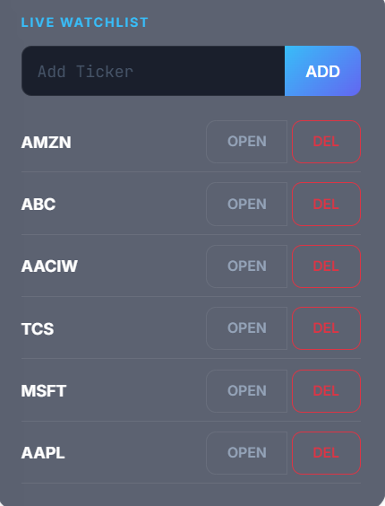
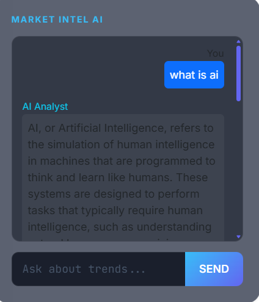
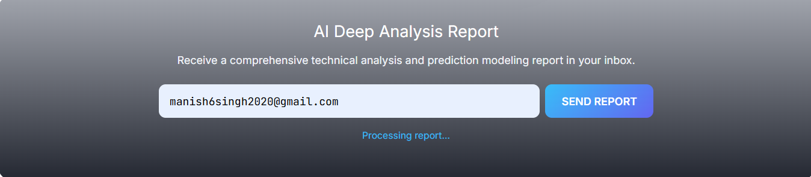

<div align="center">

# 🚀 StockAI

### _AI-Powered Stock Market Prediction Platform_

[](https://python.org)
[](https://djangoproject.com)
[](https://tensorflow.org)
[](https://plotly.com)
[](https://redis.io)
[](LICENSE)

> **Predict. Analyze. Invest.**  
> A full-stack intelligent stock market platform combining LSTM deep learning, real-time AI chat, and automated email analysis reports — all in one sleek dashboard.

---

[📊 Features](#-features) • [🖼️ Screenshots](#️-screenshots) • [🛠️ Tech Stack](#️-tech-stack) • [🚀 Quick Start](#-quick-start) • [📁 Project Structure](#-project-structure)

</div>

---

## ✨ Features

| # | Feature | Description |
|---|---------|-------------|
| 📊 | **Historical Data Viewer** | Live interactive Plotly charts for any stock ticker via `yfinance` |
| 🤖 | **LSTM AI Prediction** | Deep learning model forecasts next price with confidence score |
| 📋 | **Live Watchlist** | Add, open, and manage your personal stock watchlist |
| 💬 | **Market Intel Chatbot** | DeepSeek-powered AI analyst answers market questions in real-time |
| 📧 | **AI Email Report** | Full technical analysis report generated by AI and sent to your inbox |

---

## 🖼️ Screenshots

### 📊 Historical Stock Data
> Search any ticker and load months of price history instantly



---

### 🤖 AI Price Prediction (LSTM)
> LSTM model forecasts the next closing price with model confidence score



---

### 📋 Live Watchlist
> Track multiple stocks — open charts or remove tickers with one click



---

### 💬 Market Intel AI Chatbot
> Ask anything about markets, trends, or stocks — powered by DeepSeek AI



---

### 📧 AI Deep Analysis Email Report
> Get a full AI-generated technical analysis report sent straight to your inbox



---

## 🛠️ Tech Stack

```
┌─────────────────────────────────────────────────────────────┐
│                        STOCKAI STACK                        │
├──────────────────┬──────────────────────────────────────────┤
│  🧠 AI / ML      │  TensorFlow · Keras · LSTM · DeepSeek API │
│  🌐 Backend      │  Django · Django REST Framework           │
│  📡 Realtime     │  Django Channels · Redis · WebSockets     │
│  📈 Data         │  yfinance · pandas · numpy                │
│  📊 Charts       │  Plotly (interactive, client-side)        │
│  🔐 Auth         │  django-allauth · Session Management      │
│  🗄️ Database     │  SQLite (dev) · MySQL (prod)              │
│  📧 Email        │  SMTP · AI-generated reports              │
│  🎨 Frontend     │  HTML5 · CSS3 · JavaScript                │
└──────────────────┴──────────────────────────────────────────┘
```

---

## 🚀 Quick Start

### Prerequisites
- Python 3.10+
- Redis server running locally
- Git

### 1️⃣ Clone the Repository
```bash
git clone https://github.com/manishsinghHQ/Stock-market-prediction-using-LSTM-with-Ai-chatbot-and-Ai-email-instructor.git
cd Stock-market-prediction-using-LSTM-with-Ai-chatbot-and-Ai-email-instructor
```

### 2️⃣ Create Virtual Environment
```bash
# Windows
python -m venv venv
venv\Scripts\activate

# macOS / Linux
python -m venv venv
source venv/bin/activate
```

### 3️⃣ Install Dependencies
```bash
pip install -r requirements.txt
```

### 4️⃣ Set Up Environment Variables
Create a `.env` file in the root directory:
```env
SECRET_KEY=your_django_secret_key_here
DEEPSEEK_API_KEY=your_deepseek_api_key_here
EMAIL_HOST_USER=your_email@gmail.com
EMAIL_HOST_PASSWORD=your_app_password_here
```

### 5️⃣ Apply Migrations
```bash
python manage.py migrate
python manage.py createsuperuser
```

### 6️⃣ Start Redis (required for real-time features)
```bash
redis-server
```

### 7️⃣ Run the Server
```bash
python manage.py runserver
```

🌐 Open **[http://127.0.0.1:8000](http://127.0.0.1:8000)** in your browser.

---

## 📁 Project Structure

```
📦 StockAI
 ┣ 📂 stockai_project/     → Django settings, URLs, WSGI/ASGI
 ┣ 📂 accounts/            → User auth, login, register, remember me
 ┣ 📂 core/                → Shared utilities and base logic
 ┣ 📂 dashboard/           → Main dashboard, watchlist, chatbot API
 ┣ 📂 ml_models/           → LSTM model training & prediction engine
 ┣ 📂 pages/               → Landing & static pages
 ┣ 📂 templates/           → HTML templates
 ┣ 📂 static/css/          → Stylesheets
 ┣ 📂 screenshots/         → 📸 App screenshots (add your images here)
 ┣ 📄 manage.py
 ┣ 📄 requirements.txt
 ┗ 📄 .env                 → (create this yourself — not committed)
```

---

## ⚙️ How It Works

```
User enters ticker (e.g. AAPL)
        │
        ▼
  yfinance fetches live data
        │
        ▼
  Plotly renders interactive chart
        │
        ▼
  [AI PREDICT] clicked
        │
        ▼
  LSTM model runs inference
        │
        ├──► Target price displayed
        ├──► Confidence score shown
        └──► Forecast overlaid on chart
        │
        ▼
  User requests email report
        │
        ▼
  AI generates full technical analysis
        │
        ▼
  📧 Report sent to inbox
```

---

## 📌 Important Notes

- 🌐 Active internet connection required for `yfinance` stock data
- 🔴 Redis must be running for Django Channels / real-time features
- 🧠 LSTM model is pre-trained — retrain via `ml_models/` module
- 🗄️ Default DB is SQLite; set `DATABASE_URL` in `.env` for MySQL
- 🔑 Never commit your `.env` file — it's in `.gitignore`

---

## 📸 Adding Screenshots to GitHub

After cloning, create the folder and add your images:
```bash
mkdir screenshots
# Add these files:
# screenshots/historical_chart.png
# screenshots/ai_forecast.png
# screenshots/watchlist.png
# screenshots/chatbot.png
# screenshots/email_report.png
```

---

<div align="center">

## 👤 Author

**Manish Singh**

[](https://github.com/manishsinghHQ)

---

⭐ **Star this repo if you found it useful!** ⭐

_Built with ❤️ using Django + TensorFlow + DeepSeek AI_

</div>
